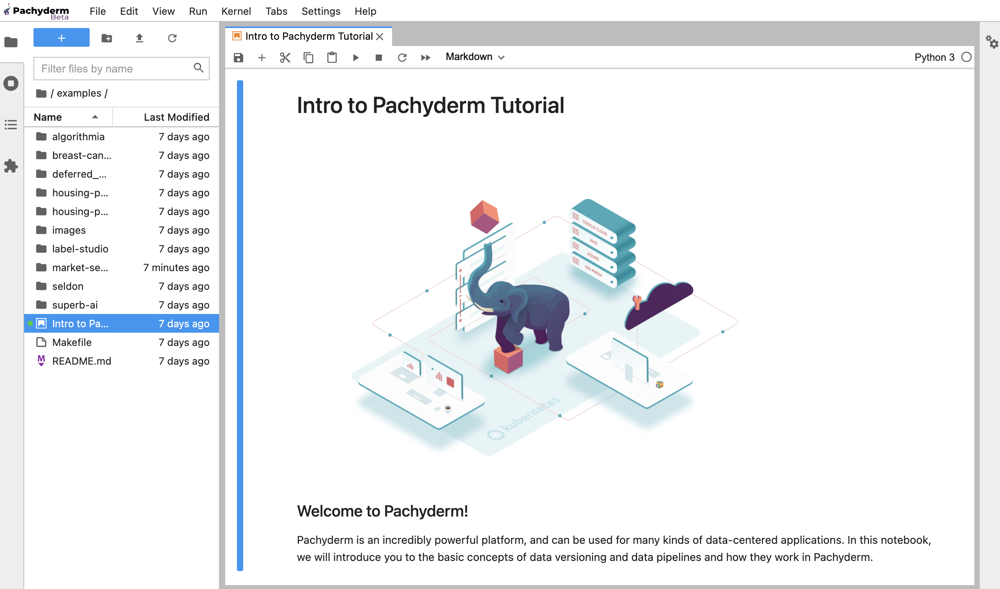

# Notebooks (beta)

!!! Warning
     - Notebooks is a [**beta**](../../../../contributing/supported-releases/#beta) release.
     - Notebooks (Pachyderm IDE) is an enterprise feature. Request your FREE 30-day [**Enterprise Edition trial token**](https://www.pachyderm.com/trial) or create a workspace on our Saas
     solution [Hub](https://hub.pachyderm.com) and experiment with Notebooks right away.

## Overview

Pachyderm Notebooks is a **JupyterHub server and a customized JupyterLab UI running next to your Pachyderm cluster**.

The Jupiter notebooks spawned from Notebooks provide data scientists with a familiar way to sample (mount repositories) or experiment with data and code written in Python. 
Because those experiments are running on Pachyderm, Data scientists benefit from the complete reproducibility that data versioning and lineage offer, while ML engineers can productionize those pipelines faster, efficiently, and securely.

## Base Image

Our Notebooks instances come with a pre-installed suite of packages, including:

 - [Jupyter Data science base image](https://hub.docker.com/layers/jupyter/datascience-notebook/python-3.8.8/images/sha256-bab39ddef7f66e05a0618a23abbf8e71cba000a5fff585b515cc3338698ec165?context=explore) with [libraries for data analysis](https://jupyter-docker-stacks.readthedocs.io/en/latest/using/selecting.html#jupyter-datascience-notebook) from the Python (scipy, scikit-learn, pandas, beautifulsoup, seaborn, matplotlib... ), R, and Julia communities. 
 - Our [Python Client `python-pachyderm`](../../reference/clients/#python-client). 
 - Our Command-Line Tool `pachctl`.

Any additional library can be installed running `pip install` from a cell.

!!! Note 
     We have also included a selection of data science examples running on Pachyderm, from a market sentiment NLP implementation using a FinBERT model to pipelines training a regression model on the Boston Housing Dataset. In the `/examples` directory, you will also find integration examples with opensource products (labeling, model serving...).
## Getting Started

!!! Note 
     See the `deploy-manage` section of this documentation to learn how to connect to Notebooks or simply click on the `Notebooks` button of your workspace on [Hub](https://hub.pachyderm.com).

The landing page of Notebooks takes you to an **Intro to Pachyderm Tutorial notebook**. 
Follow along to learn the basics of Pachyderm (repos, pipelines, commits, etc...) from your familiar Jupiter notebook. 

!!! Note 
     You might have noticed that we used `pachctl` in this Tutorial. Feel free to use 'python-pachyderm' instead. 
