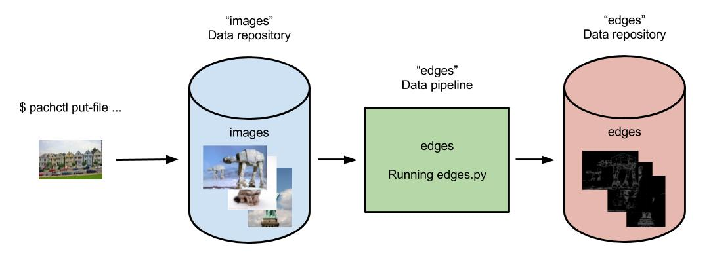

# Getting Data Out of Pachyderm

Once you've got one or more pipelines built and have data flowing through Pachyderm, you need to be able to track that data flowing through your pipeline(s) and get results out of Pachyderm. Let's use the [OpenCV pipeline](../getting_started/beginner_tutorial) as an example. 

Here's what our pipeline and the corresponding data repositories look like:



Every commit of new images into the "images" data repository results in output commits of results into the "edges" data repository. But how do we get our results out of Pachyderm?  Moreover, how would we get the particular result corresponding to a particular input image?  That's what we will explore here.

## Getting files with `pachctl`

The `pachctl` CLI tool [command `get-file`](../pachctl/pachctl_get-file) can be used to get versioned data out of any data repository:

```sh
pachctl get-file <repo> <commit-id> path/to/file
```

In the case of the OpenCV pipeline, we could get out an image named `example_pic.jpg`:

```sh
pachctl get-file edges master /example_pic.jpg
```

But how do we know which files to get?  Of course we can use the `pachctl list-file` command to see what files are available.  But how do we know which results are the latest, came from certain input, etc.?  In this case, we would like to know which edge detected images in the `edges` repo come from which input images in the `images` repo.  This is where provenance and the `flush-commit` command come in handy.

## Examining file provenance with flush-commit 

(PLACEHOLDER need to replace output with new OpenCV 1.4 versions)

Generally, `flush-commit` will let our process block on an input commit until all of the output results are ready to read. In other words, `flush-commit` lets you view a consistent global snapshot of all your data at a given commit. You can read about other advanced features of Provenance, such as data lineage, in our ["How to leverage provenance"](../cookbook/how_to_leverage_provenance) Guide, but we're just going to cover a few aspects of `flush-commit` here. 

Let's demonstrate a typical workflow using `flush-commit`. First, we'll make a few commits of data into the `images` repo on the `master` branch.  That will then trigger our `edges` pipeline and generate three output commits in our `edges` repo:

```sh
$ pachctl list-commit images
BRANCH              REPO/ID             PARENT              STARTED             DURATION             SIZE                
master              images/master/0     <none>              About an hour ago   Less than a second   57.27 KiB           
master              images/master/1     master/0            About an hour ago   Less than a second   181.1 KiB           
master              images/master/2     master/1            About an hour ago   Less than a second   693.8 KiB           
$ pachctl list-commit edges
BRANCH                             REPO/ID                                    PARENT                               STARTED             DURATION            SIZE                
5a57c906fdf14616a559c1aa74b19bac   edges/5a57c906fdf14616a559c1aa74b19bac/0   <none>                               About an hour ago   10 minutes          22.22 KiB           
5a57c906fdf14616a559c1aa74b19bac   edges/5a57c906fdf14616a559c1aa74b19bac/1   5a57c906fdf14616a559c1aa74b19bac/0   About an hour ago   3 seconds           111.4 KiB           
5a57c906fdf14616a559c1aa74b19bac   edges/5a57c906fdf14616a559c1aa74b19bac/2   5a57c906fdf14616a559c1aa74b19bac/1   About an hour ago   3 seconds           100.1 KiB           
$ 
```

In this case, we have one output commit per one input commit on our one input repo.  However, this might get more complicated for pipelines with multiple branches, multiple inputs, etc.  To confirm which commits correspond to which outputs, we can use `flush-commit`.  In particular, we can call `flush-commit` on any one of our commits into `images` to see which output came from this particular commmit:

```sh
$ pachctl flush-commit images/master/1
BRANCH                             REPO/ID                                    PARENT                               STARTED             DURATION             SIZE                
master                             images/master/1                            master/0                             About an hour ago   Less than a second   181.1 KiB           
5a57c906fdf14616a559c1aa74b19bac   edges/5a57c906fdf14616a559c1aa74b19bac/1   5a57c906fdf14616a559c1aa74b19bac/0   About an hour ago   3 seconds            111.4 KiB
```

## Exporting data via `output`

In addition to getting data out of Pachyderm with `pachctl get-file`, you can add an optional `output` field to your [pipeline specification](../reference/pipeline_spec).  `output` allows you to push the results of a Pipeline to an external data store such as S3, Google Cloud Storage or Azure Blob Storage. Data will be pushed after the user code has finished running but before the job is marked as successful.

## Other ways to view, interact with, or export data in Pachyderm

Although `pachctl` and `output` provide easy ways to interact with data in Pachyderm repos, they are by no means the only ways.  For example, you can:

- Have one or more of your pipeline stages connect and export data to databases running outside of Pachyderm.
- Use a [Pachyderm service](../cookbook/how_to_run_services_in_pachyderm_PLACEHOLDER) to launch a long running service, like Jupyter, that has access to internal Pachyderm data and can be accessed externally via a specified port.
- Mount versioned data from the distributed file system via `pachctl mount ...` (a feature best suited for experimentation and testing).
