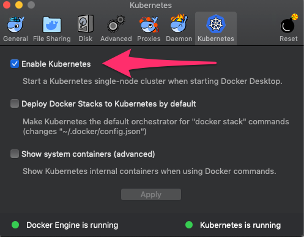
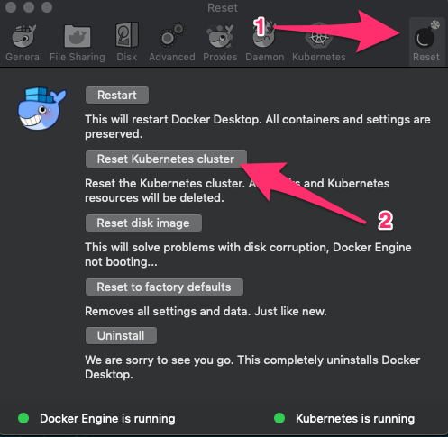

# Local Installation
This guide will walk you through the recommended path to get Pachyderm running locally on OSX or Linux.

If you hit any errors not covered in this guide, check our [general troubleshooting](../managing_pachyderm/general_troubleshooting.html) docs for common errors, submit an issue on [GitHub](https://github.com/pachyderm/pachyderm), join our [users channel on Slack](http://slack.pachyderm.io/), or email us at [support@pachyderm.io](mailto:support@pachyderm.io) and we can help you right away.

## Prerequisites
- [Minikube](#minikube) (and VirtualBox) or [Docker Desktop (v18.06+)](#dockerdesktop)
- [Pachyderm Command Line Interface](#pachctl)

### Minikube

Kubernetes offers a fantastic guide to [install minikube](http://kubernetes.io/docs/getting-started-guides/minikube). Follow the Kubernetes installation guide to install Virtual Box, Minikube, and Kubectl. Then come back here to start Minikube:
```shell
minikube start
```

Note: Any time you want to stop and restart Pachyderm, you should start fresh with `minikube delete` and `minikube start`. Minikube isn't meant to be a production environment and doesn't handle being restarted well without a full wipe. 

### Docker Desktop
First you need to make sure kubernetes is enabled in the docker desktop settings 



And then confirm things are running

```
$ kubectl get all
NAME                 TYPE        CLUSTER-IP   EXTERNAL-IP   PORT(S)   AGE
service/kubernetes   ClusterIP   10.96.0.1    <none>        443/TCP   56d
```

To reset your kubernetes cluster on Docker For Desktop just click the reset button in the preferences section 



### Pachctl

`pachctl` is a command-line utility used for interacting with a Pachyderm cluster.


```shell
# For OSX:
$ brew tap pachyderm/tap && brew install pachyderm/tap/pachctl@1.8

# For Debian based linux (64 bit) or Window 10+ on WSL:
$ curl -o /tmp/pachctl.deb -L https://github.com/pachyderm/pachyderm/releases/download/v1.8.0/pachctl_1.8.0_amd64.deb && sudo dpkg -i /tmp/pachctl.deb

# For all other linux flavors
$ curl -o /tmp/pachctl.tar.gz -L https://github.com/pachyderm/pachyderm/releases/download/v1.8.0/pachctl_1.8.0_linux_amd64.tar.gz && tar -xvf /tmp/pachctl.tar.gz -C /tmp && sudo cp /tmp/pachctl_1.8.0_linux_amd64/pachctl /usr/local/bin
```


Note: To install an older version of Pachyderm, navigate to that version using the menu in the bottom left. 

To check that installation was successful, you can try running `pachctl help`, which should return a list of Pachyderm commands.

## Deploy Pachyderm
Now that you have Minikube running, it's incredibly easy to deploy Pachyderm.

```sh
$ pachctl deploy local
```
This generates a Pachyderm manifest and deploys Pachyderm on Kubernetes. It may take a few minutes for the Pachyderm pods to be in a `Running` state, because the containers have to be pulled from DockerHub. You can see the status of the Pachyderm pods using `kubectl get pods`. When Pachyderm is ready for use, this should return something similar to:

```sh
$ kubectl get pods
NAME                     READY     STATUS    RESTARTS   AGE
dash-6c9dc97d9c-vb972    2/2       Running   0          6m
etcd-7dbb489f44-9v5jj    1/1       Running   0          6m
pachd-6c878bbc4c-f2h2c   1/1       Running   0          6m
```

**Note**: If you see a few restarts on the `pachd` nodes, that's ok. That simply means that Kubernetes tried to bring up those pods before `etcd` was ready so it restarted them.

### Port Forwarding

The last step is to set up port forwarding so commands you send can reach Pachyderm within the VM. We background this process since port forwarding blocks.

```shell
$ pachctl port-forward &
```

Once port forwarding is complete, pachctl should automatically be connected. Try `pachctl version` to make sure everything is working.

```shell
$ pachctl version
COMPONENT           VERSION
pachctl             1.7.0
pachd               1.7.0
```
We're good to go!

If for any reason `port-forward` doesn't work, you can connect directly by setting `ADDRESS` to the minikube IP with port 30650. 

```
$ minikube ip
192.168.99.100
$ export ADDRESS=192.168.99.100:30650
```

## Next Steps

Now that you have everything installed and working, check out our [Beginner Tutorial](./beginner_tutorial.html) to learn the basics of Pachyderm such as adding data and building pipelines for analysis.

The Pachyderm Enterprise dashboard is deployed by default with Pachyderm. You can get a FREE trial token and experiment with this interface to Pachyderm by visiting `localhost:30080` in your Internet browser (e.g., Google Chrome).  


